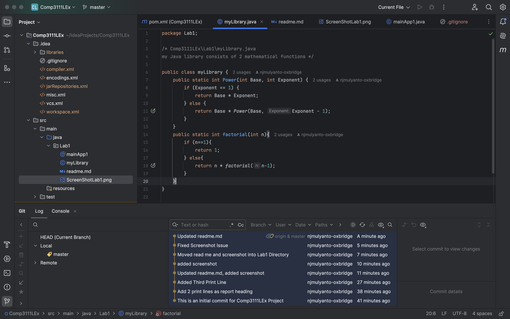

Hello this is my first time using Java and my first time creating a project using IntelliJ.
This project contains a basic program about factorials.
I have learnt the way to make a Java project in IntelliJ :)
